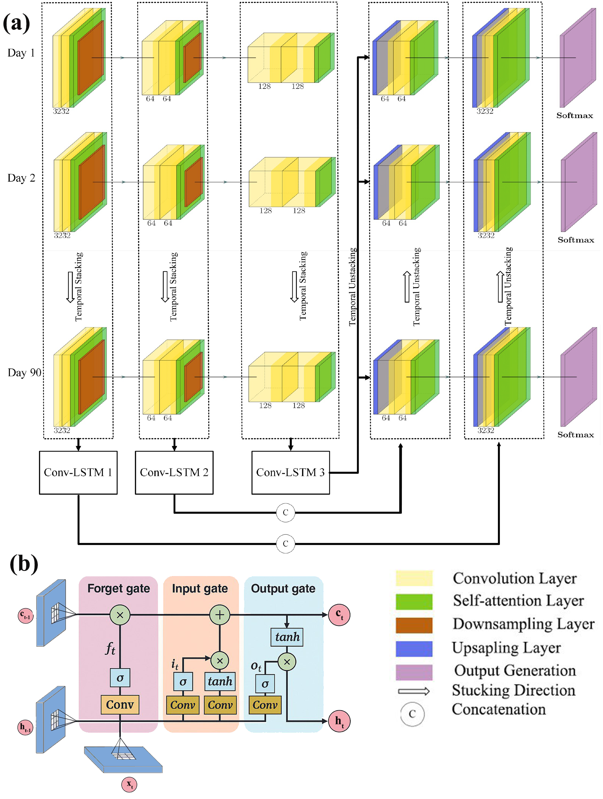

# Season-Net
Season-Net is a deep learning framework specifically developed to address the systematic biases in seasonal climate forecasts, with a focus on correcting temperature predictions from ensemble models such as C3S seasonal forecast models. This architecture is adapted and significantly extended from [Kamangir et al., 2024](https://doi.org/10.1016/j.compag.2023.108439), originally published in *Computers and Electronics in Agriculture*. While the core idea provided initial inspiration, our version introduces major architectural changes, including a modified encoder-decoder structure, integration of ConvLSTM blocks, and specialized loss functions for seasonal climate bias correction. Traditional seasonal forecasts often exhibit regional and temporal biases due to model initialization errors, coarse resolution, and limitations in representing physical processes. Season-Net introduces a hybrid neural architecture that combines a spatially aware U-Net encoder-decoder structure with ConvLSTM modules that are capable of learning temporal dependencies across forecast lead times. This design allows the model to simultaneously capture spatial context and temporal evolution of biases, making it well-suited for the correction of forecasted gridded climate data over multiple months. Key features of Season-Net include its ability to ingest multiple input variables (e.g., 2m temperature, geopotential height, precipitation), integrate ensemble statistics, and apply customized loss functions such as quantile-based metrics to encourage deterministic and probabilistic fidelity. The architecture supports land–sea masking, variable-specific bias patterns, and topographically-aware learning by incorporating auxiliary fields when available. Season-Net is designed to operate at a 1.0° × 1.0° spatial resolution, with flexible support for multiple initialization months (e.g., February, May, August, November) and forecast horizons of up to 3 months. It is compatible with ERA5 reanalysis as the reference dataset and follows a pipeline that enables seamless evaluation using standard climate metrics such as RMSE, correlation, bias, and probabilistic skill scores. To ensure efficient training and scalability over large climate datasets, Season-Net was trained and evaluated using two NVIDIA A100 GPUs (each with 80 GB of memory) on the Apocrita High-Performance Computing (HPC) cluster maintained by Queen Mary University of London. This high-memory GPU setup enabled full-resolution processing of ensemble seasonal forecasts with extended lead times and deep attention-based architectures, without the need for aggressive spatial or temporal patching. By improving the spatial accuracy and temporal coherence of seasonal forecasts, Season-Net enables downstream applications in climate risk assessment, drought prediction, and sectoral planning to benefit from more reliable and skillful forecast products.


# 🔍 Key Features

- ✅ U-Net encoder-decoder structure with skip connections
- 🔁 Spatiotemporal modeling using ConvLSTM layers
- 📉 Tailored loss functions for quantile-based bias correction
- 📊 Output diagnostics include RMSE, correlation, and probabilistic verification metrics
- 🌍 Designed for climate data grids (e.g., [Batch, Lat, Lon, Time, Features])

---

# 📁 Repository Contents

- `modules/` — Custom PyTorch modules for UNet-ConvLSTM
- `unet2dconvlstm.py` — Main model architecture
- `engine.py` — Training and validation loop
- `run.py` — Script to initialize and train Season-Net
- `figures/` — Evaluation plots and architecture image
- `README.md` — This file

---

# 🧪 Data Requirements

Season-Net was developed using:
- 📈 **Input**: C3S seasonal forecasts (e.g., 2m temperature, Z500, etc.)
- 🎯 **Target**: ERA5 reanalysis (used as ground truth)
- 🌐 Spatial resolution: 1.0° × 1.0° grid (modifiable)
- ⏱️ Temporal coverage: Monthly initializations (e.g., Feb/May/Aug/Nov), 3 month lead time

---
## ⚙️ Training & Usage

Before training:
1. Prepare C3S forecast models and ERA5 data in NetCDF format
2. Configure parameters in `run.py` (e.g., years, variables, batch size)
3. Launch training with:

```bash
python run.py --mode train
```

To evaluate or infer:

```bash
python run.py --mode eval
```

Model output will include corrected forecasts, evaluation scores, and figures.

---


## 📬 Contact

For questions, please contact Zahir Nikraftar at z.nikraftar@qmul.ac.uk.
